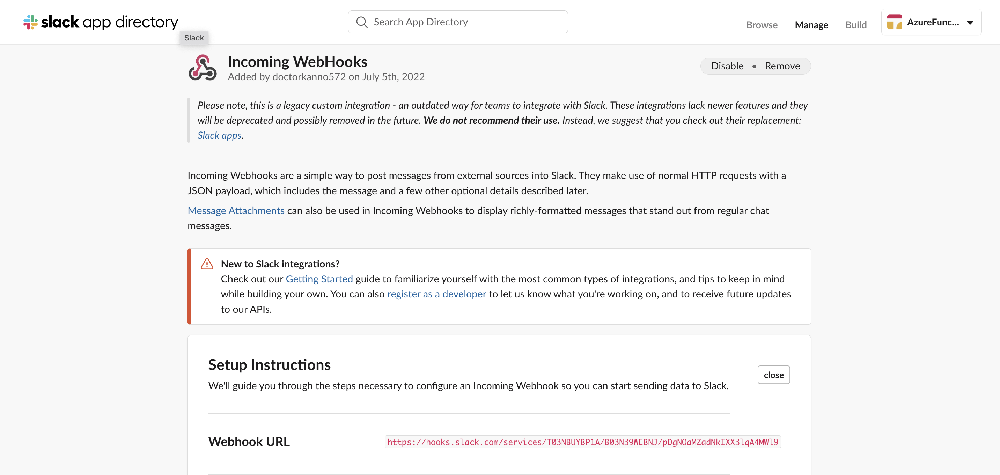
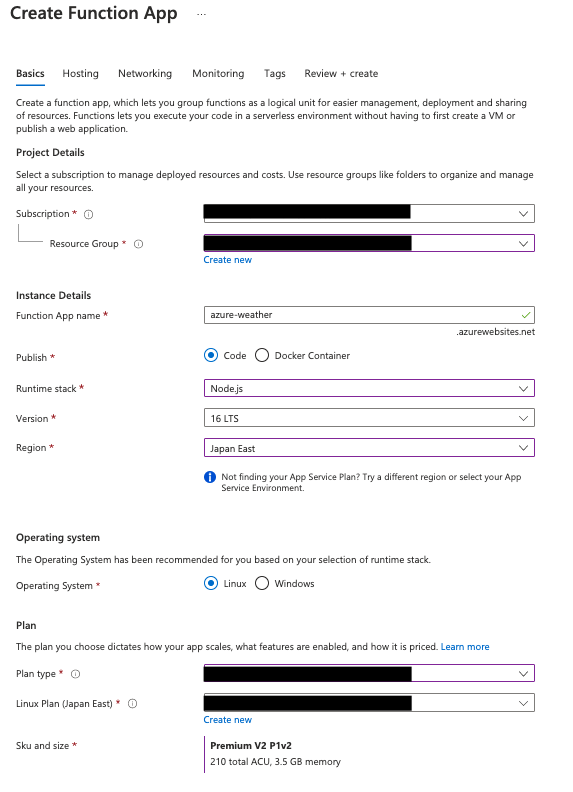
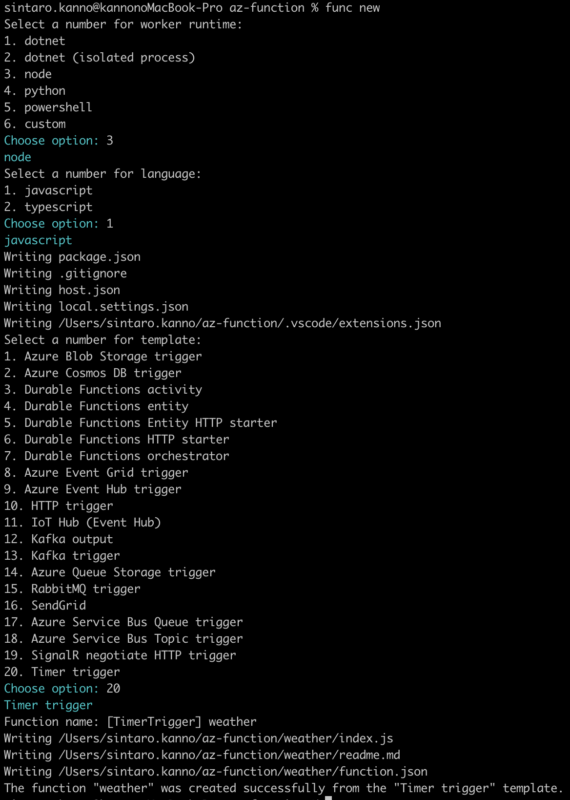
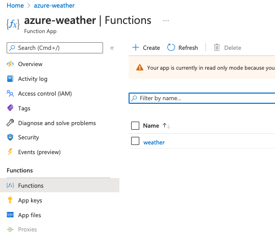
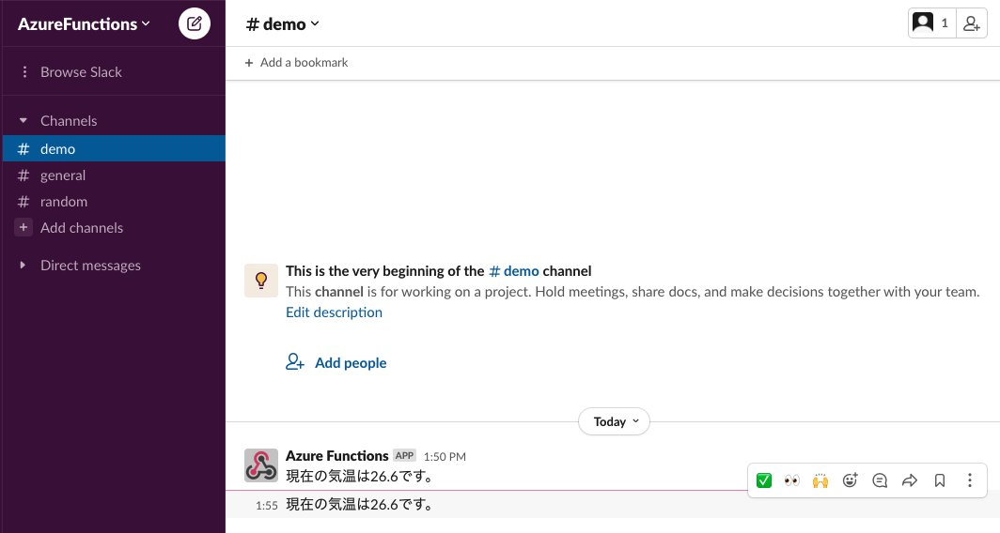

---
# try also 'default' to start simple
theme: seriph
# random image from a curated Unsplash collection by Anthony
# like them? see https://unsplash.com/collections/94734566/slidev
background: https://source.unsplash.com/collection/94734566/1920x1080
# apply any windi css classes to the current slide
class: 'text-center'
# https://sli.dev/custom/highlighters.html
highlighter: shiki
# show line numbers in code blocks
lineNumbers: false
# some information about the slides, markdown enabled
info: |
  ## Slidev Starter Template
  Presentation slides for developers.

  Learn more at [Sli.dev](https://sli.dev)
# persist drawings in exports and build
drawings:
  persist: false
---

# Azure Functionsを使ってSlackに通知をしてみよう

---

# 自己紹介

<div class="intro">
  <div>
  
  - 名前
    - 官野 慎太朗 (かんの しんたろう)

<!--  -->

  - 業務
    - 都内IT企業にてWeb系の開発業務に従事。

  - 技術経験
    - Golang, JavaScript/TypeScript, MySQL, PostgreSQL, docker/kubernetes, etc...
  
  </div>

  <div>
    
  </div>

</div>

<style>
  .intro {
    display: flex;
    /* justify-content: space-around; */
  }

  .profile{
    width: 60%;
    margin-left: 100px;
    border-radius: 130px;
  }
</style>
---

# 目次
1. Azure Functionsとは
2. 今回使用する技術について
3. Slack Webhook URLの取得
4. Function Appの設定
5. ローカル上でのプログラム実装
6. Function Appへのデプロイ

---

# Azure Functionsとは

- Azure(Microsoft社)が提供するサービスの一種。
- クラウド上にプログラムを実装することができる。
- 類似サービス：AWS Lambda, GCP Cloud Function

<div class="container">
  <div class="item"></div>
  <div class="item"></div>
  <div class="item"></div>
</div>


<style>
  .container {
    display: flex;
    justify-content: space-around;
    margin-top: 5%;
  }
  .logo {
    width: 200px;
    height: 200px;
  }

</style>
---

# 今回使用する技術
- Azure Functions Core Tools
- JavaScript
- Slack Webhook URL
- Weather Forecast API (Open-Meteo社)

---

# Slack Webhook URLの取得
- Slack連携には`Incoming Webhook URL`の発行が必要
- `Slack app directory`の`Custom Integrations > Incoming WebHooks`より任意のWorkspaceのWebhook URL発行可能。

<div class="slack-container">
  <div class="slack-item">
    
    <p class="des">Incoming WebHooksよりWeb hook URLを作成</p>
  </div>

</div>

<style>
  .slack-img {
    width: 700px;
    height: 300px;
    border: 1px solid black;
  }

  .des {
    color: gray;
    padding-left: 150px;
  }

  .slack-container {
    display: flex;
    justify-content: space-around;
  }
</style>

---

# Function Appの設定

<div class="func-app-container">

  <div>

  - Azure Portal上でFunction Appを構築
  - 今回の名称は`azure-weather`
  - 環境変数にSlack Webhook URLを設定

  </div>


  <div>
    
  </div>

</div>


<style>
  .func-app-container {
    display: flex;
    justify-content: space-between;
  }

  .function-app-img {
    width: 300px;
    margin-right: 100px;
    border: 1px solid black;
  }
</style>

---

# ローカル上でのプログラム実装

<div class="local-container">
  <div>

  - ローカルに空の`az-function`というディレクトリを作成
  - `az-function`内で`func new`を実行
    - runtimeは`node`
    - 使用する言語は `JavaScript`
    - templateは`TimerTrigger`
    - Function Nameは`weather`
  
  </div>


  <div>
    
    <p class="des">対話形式で関数を作成</p>
  </div>

</div>


<style>
  .local-container {
    display: flex;
    justify-content: space-between;
  }

  .function-new-img {
    width: 300px;
    margin-right: 10px;
  }

  .des{
    color: gray;
    font-size: 80%;
    margin-left: 20%;
    margin-top: 0;
  }
</style>

---

### 初期ディレクトリ構成

- 今回手を加えるのは`index.js`と`function.json`

<div>

```
 |- .vscode
      |- extention.json
 |- weather
      |- function.json ←★
      |- index.js　←★
      |- readme.md
 |- .gitignore
 |- host.json
 |- local.setting.json
 |- package-lock.json
 |- package.json
```

</div>

---

### 実装部分

- `axios`と`@slack/webhook`を使用
- `func start`でローカル実行

```js
const axios = require('axios');
const { IncomingWebhook } = require('@slack/webhook');

module.exports = async function (context, myTimer) {
  // ~~~~~~ 以下実装部分 ~~~~~~
  const response = await axios.get('https://api.open-meteo.com/v1/forecast?latitude=35.6785&longitude=139.6823&hourly=temperature_2m&current_weather=true&timeformat=unixtime&timezone=Asia/Tokyo')
    
  const webhook = new IncomingWebhook(process.env.WEBHOOK)

  await webhook.send({
      text: `現在の気温は${response.data.current_weather.temperature}です。`,
      channel: "#demo",
      username: "Azure Functions",
  })
  // ~~~~~~ 実装部分ここまで ~~~~~~
};

```

---

# Function Appへのデプロイ
- `function.json`を編集
  - 実行間隔を5分おきに設定
  - `scriptFile`を`index.js`に指定
- <b>package.jsonをweatherに移動</b>
- `azure-weather`に`weather`ディレクトリをデプロイ
  - 実行コマンド：`func azure functionapp publish azure-weather`


<div class="deploy-container">
  <div>

  <p>function.json内部</p>

  ```json
  {
    "bindings": [
      {
        "name": "myTimer",
        "type": "timerTrigger",
        "direction": "in",
        "schedule": "0 */5 * * * *"
      }
    ],
    "scriptFile": "index.js"
  }
  ```

  </div>

  <div>
  <p>weaher内の最終的な構成</p>

  ```
   |- weather
        |- function.json
        |- index.js
        |- readme.md
        |- package.json ← 上の階層から移動
  ```

  </div>

</div>

<style>
  p {
    color: gray;
  }

  .deploy-container {
    display: flex;
    justify-content: space-around;
  }
</style>

---

### デプロイ後のazure-weather
- Functionsに`weather`が存在
- 5分おきに現在の気温をSlackへ通知

<div class="after-container">
  <div>
    <p class="p1">デプロイされたweather</p>
    
  </div>
  <div>
    <p class=p2>Slackへの気温の通知</p>
    
  </div>
</div>


<style>
  .p1 {
    color: gray;
    margin-left: 50px;
  }

  .p2 {
    color: gray;
    margin-left: 180px;
  }

  .after-img {
    width: 300px;
    height: 300px;
    border: 1px solid black;
  }

  .res {
    width: 500px;
  }

  .after-container {
    display: flex;
    justify-content: space-between;
  }
</style>